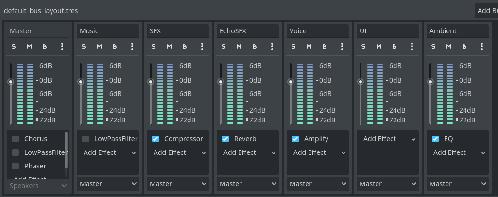
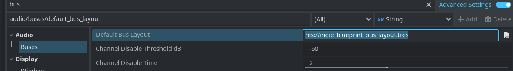
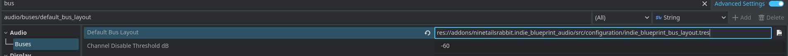
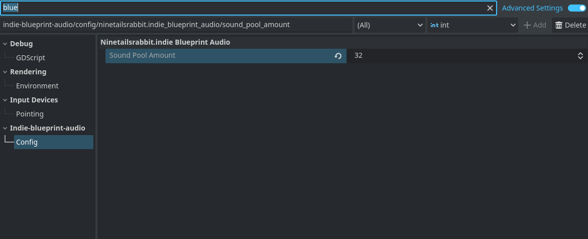

<div align="center">
	

<h3 align="center">Indie Blueprint Audio</h3>

  <p align="center">
   Easily control game audio with features like volume adjustments, playlists, crossfading, and sound pools.
	<br />
	·
	<a href="https://github.com/ninetailsrabbit/indie-blueprint-audio/issues/new?assignees=ninetailsrabbit&labels=%F0%9F%90%9B+bug&projects=&template=bug_report.md&title=">Report Bug</a>
	·
	<a href="https://github.com/ninetailsrabbit/indie-blueprint-audio/issues/new?assignees=ninetailsrabbit&labels=%E2%AD%90+feature&projects=&template=feature_request.md&title=">Request Features</a>
  </p>
</div>

<br>
<br>

- [📦 Installation](#-installation)
  - [Bus configuration layout](#bus-configuration-layout)
- [AudioManager 🔊](#audiomanager-)
  - [Automatic unmute \& mute buses on application focus in \& out](#automatic-unmute--mute-buses-on-application-focus-in--out)
  - [Bus](#bus)
  - [Default audio volumes](#default-audio-volumes)
  - [Handling volume](#handling-volume)
  - [Audio effects](#audio-effects)
- [MusicManager 📻](#musicmanager-)
  - [MusicTrack](#musictrack)
  - [MusicPlaylist](#musicplaylist)
  - [Signals](#signals)
  - [Music bank](#music-bank)
  - [Play modes](#play-modes)
  - [Playlists](#playlists)
- [SoundPool 🎼](#soundpool-)
- [SoundQueue 🔉](#soundqueue-)
- [ConsumableAudioStreamPlayer 🔉](#consumableaudiostreamplayer-)

# 📦 Installation

1. [Download Latest Release](https://github.com/ninetailsrabbit/indie-blueprint-audio/releases/latest)
2. Unpack the `addons/indie-blueprint-audio` folder into your `/addons` folder within the Godot project
3. Enable this addon within the Godot settings: `Project > Project Settings > Plugins`

To better understand what branch to choose from for which Godot version, please refer to this table:
|Godot Version|indie-blueprint-audio Branch|indie-blueprint-audio Version|
|---|---|--|
|[](https://godotengine.org/)|`4.3`|`1.x`|
|[](https://godotengine.org/)|`main`|`1.x`|

This autoloads are intended to manage all audio related things in your game, changing volume, playlist, crossfade between streams, sound pool and much more.

## Bus configuration layout



---

This plugin provides a bus configuration suitable for most projects plus the `AudioManager` is built around it.

To integrate it, please follow these steps:

- Copy the file `res://addons/ninetailsrabbit.indie_blueprint_audio/src/configuration/indie_blueprint_bus_layout.tres` and move it into your Godot project _(res:// is the recommended path)_.

- Modify the `default bus layout path` in your project settings under the section `Audio/Buses`.

---



---

**_Alternatively, you can directly assign the plugin bus layout path in this option. However, it is advisable to avoid altering the original files in case of modifications_**



---

# AudioManager 🔊

This autoload is intended for the most basic operations such as getting bus information, changing the volume and so on.
The available buses are based on the default bus layout provided in this template that you can find in the [Configuration](#configuration) section.

## Automatic unmute & mute buses on application focus in & out

The buses are muted automatically when your game executable is not being focused when for example the player may have left with the windows key to look at the desktop.

```swift
func _notification(what):
	match what:
		NOTIFICATION_APPLICATION_FOCUS_OUT:
			mute_all_buses()
		NOTIFICATION_APPLICATION_FOCUS_IN:
			unmute_all_buses()
```

## Bus

```swift
// Available constants
const MasterBusIndex = 0

const MasterBus: StringName = &"Master"
const MusicBus: StringName = &"Music"
const SFXBus: StringName = &"SFX"
const EchoSFXBus: StringName = &"EchoSFX"
const VoiceBus: StringName = &"Voice"
const UIBus: StringName = &"UI"
const AmbientBus: StringName = &"Ambient"

// Available get methods that returns the bus index
func master_bus() -> int

func music_bus() -> int

func sfx_bus() -> int

func echosfx_bus() -> int

func voice_bus() -> int

func ui_bus() -> int

func ambient_bus() -> int
```

## Default audio volumes

This template set an opinionated default volumes but feel free to change this dictionary in the `AudioManager` to fit your requirements. These values are loaded the first time you start your game or reset to default values.

```swift
static var default_audio_volumes: Dictionary = {
	MasterBus.to_lower(): 0.9,
	MusicBus.to_lower(): 0.8,
	SFXBus.to_lower(): 0.9,
	EchoSFXBus.to_lower(): 0.9,
	VoiceBus.to_lower(): 0.8,
	UIBus.to_lower(): 0.7,
	AmbientBus.to_lower(): 0.9
}

// Reset current bus volumes to default
func reset_to_default_volumes() -> void


// In addition, you can access the default bus volume value with the following method
AudioManager.get_default_volume_for_bus(bus) // Where bus can be received as int or String.
```

## Handling volume

The `AudioManager` provides few methods to operate with volume in an easy way. The bus parameter can be passed as the integer index or String

```swift

func get_default_volume_for_bus(bus) -> float:

// Change the volume of selected bus_index if it exists
func change_volume(bus, volume_value: float) -> void

func get_actual_volume_db_from_bus(bus) -> float

func get_actual_volume_db_from_bus_name(bus_name: String) -> float

func get_actual_volume_db_from_bus_index(bus_index: int) -> float

func all_buses_are_muted() -> bool

func is_muted(bus = MasterBusIndex) -> bool

func mute_bus(bus, mute_flag: bool = true) -> void

func mute_all_buses() -> void

func unmute_all_buses() -> void
```

## Audio effects

The buses have some effect filters already set up. To activate them you can use the following methods:

```swift
func apply_master_bus_low_pass_filter() -> void

func remove_master_bus_low_pass_filter() -> void

func apply_master_bus_chorus_filter() -> void

func remove_master_bus_chorus_filter() -> void

func apply_master_bus_phaser_filter() -> void

func remove_master_bus_phaser_filter() -> void
```

# MusicManager 📻

The `MusicManager` autoload provides methods to play music that is persistent between scenes in your game. It has support for playlist and crossfade between streams.

The `default_crossfade_time` is `5`

It works with 2 basic Resources `MusicTrack` and `MusicPlaylist` that are very easy to create and configure for reuse between your projects.

## MusicTrack

```swift
class_name MusicTrack extends Resource

@export var track_name: StringName = &""
@export var artist: StringName = &""
@export var stream: AudioStream
@export var bus: StringName


func _init(_stream: AudioStream, _name: StringName, _artist: StringName, _bus: StringName) -> void
```

## MusicPlaylist

```swift
class_name MusicPlaylist extends Resource

@export var playlist_name: StringName = &""
@export var tracks: Array[MusicTrack]


func _init(_name: StringName = &"", _tracks: Array[MusicTrack] = []) -> void
```

## Signals

```swift
changed_play_mode(new_mode: PlayMode)

added_track_to_music_bank(track: MusicTrack)
removed_track_from_music_bank(track: MusicTrack)

changed_track(from: MusicTrack, to: MusicTrack)
started_track(new_track: MusicTrack)
finished_track(track: MusicTrack)

created_playlist(playlist: MusicPlaylist)
removed_playlist(playlist: MusicPlaylist)
changed_playlist(from: MusicPlaylist, to: MusicPlaylist)
started_playlist(playlist: MusicPlaylist)
finished_playlist(playlist: MusicPlaylist)
```

## Music bank

A music bank is an array of music tracks available in your music manager. If the stream is not here for the manager it does not exist.

```swift
var music_bank: Array[MusicTrack] = []

// Available methods to manipulate tracks
func add_music_tracks_to_bank(tracks: Array[MusicTrack])

func add_music_track_to_bank(track: MusicTrack)

func remove_track_from_bank(track: MusicTrack)

func remove_tracks_from_bank(tracks: Array[MusicTrack])


func pause_current_track() -> void

func replay_current_track() -> void

func play_music_from_bank(track, crossfade: bool = true, crossfade_time: float = default_crossfade_time)

func pick_random_track_from_bank(except: Array[MusicTrack]= []) -> MusicTrack

func get_music_from_bank(track_name: StringName) -> MusicTrack

// Syntactic sugar to play a music track, it calls play_music_from_bank behind the scenes
func change_track_to(new_stream_name: String, crossfade: bool = true, crossfade_time: float = default_crossfade_time) -> void

func change_track(new_stream_name: String, crossfade: bool = true, crossfade_time: float = default_crossfade_time) -> void

func change_music(new_stream_name: String, crossfade: bool = true, crossfade_time: float = default_crossfade_time) -> void

func change_music_to(new_stream_name: String, crossfade: bool = true, crossfade_time: float = default_crossfade_time) -> void
```

## Play modes

The `MusicManager` is played based on the selected `PlayMode`. By default is set to `PlayMode.Manual`

```swift
enum PlayMode {
	Manual, // The music tracks are manually initiated somewhere in your code
	RandomMusicFromBank, // Once a stream ends, get another random stream from the music bank.
	Playlist // Uses a playlist provided in which song s are played sequentially.
}

// Update
func change_mode_to_manual() -> void

func change_mode_to_random_music_from_bank() -> void

func change_mode_to_playlist() -> void

func change_mode(new_play_mode: PlayMode) -> void

// Get
func is_manual_mode() -> bool

func is_random_music_mode() -> bool

func is_playlist_mode() -> bool
```

## Playlists

This manager allows you to create multiple playlists and select them in a very easy way. You can pass the playlist parameter as its id or the `MusicPlaylist` resource as such.

```swift

// Dictionary<String, MusicPlaylist>
var music_playlists: Dictionary = {}


func start_playlist(playlist, from_track: int = 0, crossfade: bool = true, crossfade_time: float = default_crossfade_time) -> void

func add_playlist(playlist: MusicPlaylist) -> void

func remove_playlist(playlist) -> void

func play_next_in_playlist(playlist: MusicPlaylist = current_playlist) -> void

func next_in_playlist(playlist: MusicPlaylist = current_playlist) -> MusicTrack
```

# SoundPool 🎼

The `SoundPool` autoload provides globally available pool of `AudioStreamPlayer`. You can increase or decrease the number of the pool and play streams when become available.

By default it creates **32** `AudioStreamPlayer` nodes.

You can change this value in the project settings



```swift
func increase_pool(pool_number: int, override: bool = false)

func decrease_pool(pool_number: int)


func play(stream: AudioStream, volume: float = 1.0, bus: String = &"Master")

func play_with_pitch(stream: AudioStream, volume: float = 1.0, pitch_scale: float = 1.0, bus: String = &"Master")

func play_with_pitch_range(stream: AudioStream, volume: float = 1.0, min_pitch_scale: float = 0.9, max_pitch_scale: float = 1.3, bus: String = &"Master")

func play_random_stream(streams: Array[AudioStream] = [], volume: float = 1.0, bus: String = &"Master")

func play_random_stream_with_pitch(streams: Array[AudioStream] = [], volume: float = 1.0, pitch_scale: float = 1.0, bus: String = &"Master")

func play_random_stream_with_pitch_range(streams: Array[AudioStream] = [], volume: float = 1.0, min_pitch_scale: float = 0.9, max_pitch_scale: float = 1.3,  bus: String = &"Master")


func stop_streams_from_bus(bus: String = &"Master")

func stop_streams_from_buses(buses: Array[String] = [&"Master"])

func pause_streams_from_bus(bus: String = &"Master")

func pause_streams_from_buses(buses: Array[String] = [&"Master"])

func unpause_streams_from_bus(bus: String = &"Master")

func unpause_streams_from_buses(buses: Array[String] = [&"Master"])
```

# SoundQueue 🔉

The `SoundQueue` node simplifies playing sounds sequentially while maintaining a queue of `AudioStreamPlayers`. It offers features like:

- **Queuing:** Manages a configurable number of AudioStreamPlayers for sequential playback.
- **Random Pitch Variation (Optional):** Introduces slight pitch variations to queued sounds upon playback (adjustable range).
- **Error Handling:** Provides warnings and error messages for potential configuration issues.

**Properties:**
`queue_count:` Defines the number of `AudioStreamPlayers` to create and manage in the queue _(default: 1)_.

**API Reference:**
`play_sound()`
Checks if the `audiostream_players` array is empty. If not empty, it verifies if the current player in the queue is not playing.

- Advances the queue index _(wrapping around to the beginning if necessary)._
- Plays the sound associated with the current queue index.

`play_sound_with_pitch_range(min_pitch_scale: float = 0.9, max_pitch_scale: float = 1.3)`:

- Similar to `play_sound` but allows specifying a minimum and maximum pitch scale factor for random variation.
- When playing a sound, it sets a random pitch scale within the specified range for the `AudioStreamPlayer` before playback.

**How to use:**

- Add the `SoundQueue` node to your scene.
- Set the desired `queue_count` in the Inspector.
- Add one `AudioStreamPlayer` _(or its 2D/3D variants)_ as child node to the `SoundQueue` with the `AudioStream` configured for your desired sound.
- Use the `play_sound` or `play_sound_with_pitch_range` methods in your game code to trigger sound playback from the queue.

```bash
var sound_queue = get_node("SoundQueue") as SoundQueue

# Play a sound from the queue
sound_queue.play_sound()

# Play a sound with random pitch variation (0.9 - 1.1 range)
sound_queue.play_sound_with_pitch_range(0.9, 1.1)
```

# ConsumableAudioStreamPlayer 🔉

They are available a consumable for each `AudioStreamPlayer` included 2D or 3D that works very simple, you can set a number of reproductions that when it reaches the number, free the `AudioStreamPlayer` from the scene.

**How to use:** Easy as add the node to the scene and modify the exported `number_of_reproductions` variable

```bash
var horn_sound = preload("res://sounds/horn.ogg")

## Via GDScript
var consumable = ConsumableAudioStreamPlayer.new(5, horn_sound) # 5 reproductions to be free
var consumable_2d = ConsumableAudioStreamPlayer2D.new(2, horn_sound) # 2 reproductions to be free
var consumable_3d = ConsumableAudioStreamPlayer3D.new(1, horn_sound) # 1 reproductions to be free
```
